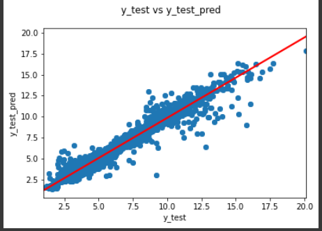
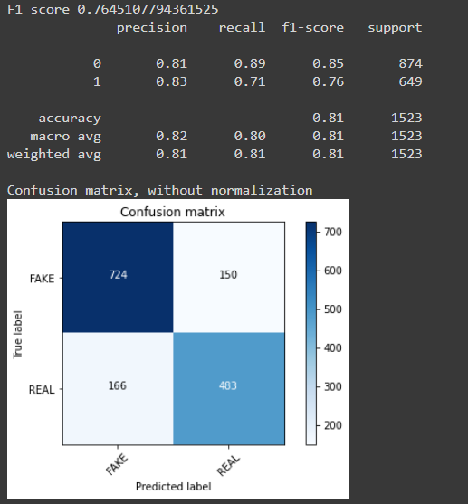

# Manish_Portfolio
Data Science Portfolio

# Project 1: A Fine Windy Day : Project Overview
+ Create a Machine Learning model that predicts the power that is generated (in KW/h) from Windmill.
+ Preprocessing on Dataset and removing nan and categorical values.
+ Using RFE finds the best parameter.
+ Optimized RandomForrestRegressor and XGBoost using GridSearchCV to reach the best model.

[Google Colab Link](https://colab.research.google.com/drive/1NnNS-3DgXhE1QOG90SIjf48rfkeMOFKg?usp=sharing)

# Project 2: Disaster Tweet Classfication : Project Overview
+ Create a Machine Learning model that classify disaster tweets
+ Preprocessing on Dataset using nltk and sklearn, removing stop word and performimg stemming.
+ Fitting the dataset on different algorithms and finding the best models
+ Optimized LogisticRegression, MultinomialNB and BernoulliNB using GridSearchCV to reach the best parameters.

[Google Colab Link](https://colab.research.google.com/drive/1ZLW7DHvmrzGjaEeUBi6oCtpMv91YULck?usp=sharing)
